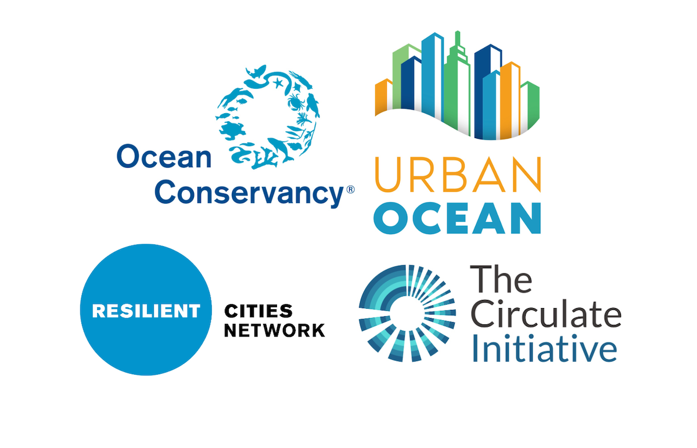
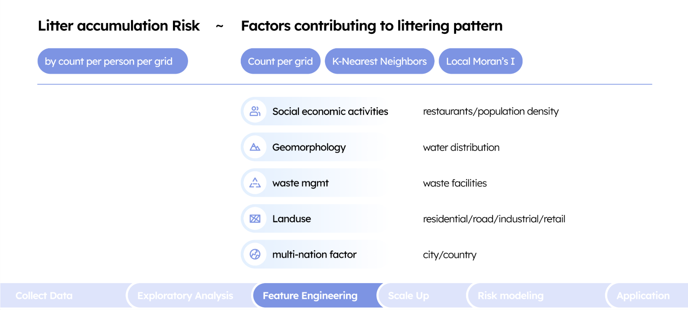
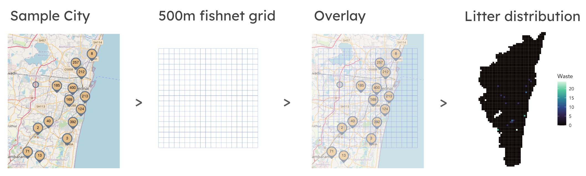
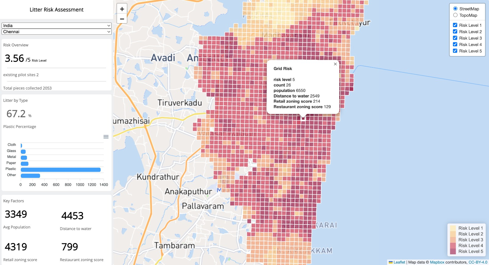

This project was completed for the Urban Spatial Analytics/Smart Cities Practicum course (MUSA 790), instructed by Michael Fichman and Matthew Harris. We are grateful to our instructors for their continued support and feedback. We are also grateful to our client Daniel Sebastian Padilla Ochoa from Ocean Conservancy for his guidance and support throughout this practicum project.

# Introduction

## Abstract

Marine litter continues to pose a major threat to people, animals, and the environment. While zero-waste pilot programs like Urban Ocean have made strides in reducing marine litter, there persists difficulty in site-selection of pilots due to lacking litter information. This adds unnecessary barriers to the siting of pilot zero-waste pickup programs. By leveraging geospatial machine learning, this project aims to explore how best to navigate zero-waste siting in areas facing bleak marine litter conditions.

## Client Background

<div style="text-align:center;">
  
  
  <br><br>
  Image Source: Ocean Conservancy, The Independent
</div>

Urban Ocean aims to prevent ocean plastic pollution by supporting projects in cities that address plastic pollution and infrastructure resilience. This includes reducing the amount of single-use plastic produced, improving waste management systems, promoting circular economy principles, building awareness, and more. Urban Ocean is an accelerator project created out of a trilateral initiative/partnership between Circulate Initiative, Resilient Cities Network, and Ocean Conservancy:

- [Resilient Cities Network](resilientcitiesnetwork.org) is a network of cities bringing together global knowledge, practice, partnerships, and funding to empower its members through building equity and resilience. The organization supports on-the-ground projects and solutions to facilitate connections and information-sharing between communities and local leaders.
- [Ocean Conservancy](www.oceanconservancy.org) is a non-profit environmental advocacy group working to advance marine health and protection. Ocean Conservancy focuses on science-based solutions for a healthy ocean and the wildlife and communities that depend on it.
- [The Circulate Initiative](www.thecirculateinitiative.org) is a non-profit organization that works to solve the plastic pollution challenge and build circular and equitable economies across emerging markets. The organization focuses on research, high-impact programs, and stakeholder collaboration to forward sustainability and equitable growth.

This program takes multiple approaches to address ocean plastic pollution. First, Urban Ocean mobilizes cleanup campaigns across each city based on volunteer efforts with international and local support groups, such as the International Coastal Cleanup. Second, they research each city's sanitation and urban systems to identify key details regarding what causes trash to end up in oceans and waterways, sharing findings and recommending action plans to local communities and decision makers and working with stakeholders directly to create changes in products, practices, and behaviors as alternative solutions to their current needs. With these efforts, each campaign requires an evaluation of local context and detailed understanding of the city's systems and dynamic. This aspect of the process requires long-term planning and methodical decision-making to understand the pre-existing conditions in place. Hence, our model aims to streamline the process of understanding the general structure of each city-context and provide a comprehensive solution on where efforts and resources should be allocated to.

We based our focus and model on the current cities from the Urban Ocean program. The 12 participating cities a part of the Urban Ocean program as of May 2024 are:

  1. Can Tho, Vietnam
  2. Chennai, India
  3. Melaka, Malaysia
  4. Mumbai, India
  5. Panama City, Panama
  6. Pune, India
  7. Santiago, Chile
  8. Semarang, Indonesia
  9. Surat, India
  10. Bangkok, Thailand
  11. Santa Fe, Argentina
  12. Salvador, Brazil

## Motivation and Use Case

As marine litter worsens across the world, litter accumulation poses significant cyclical health, biodiversity, and climate risks. For example, an estimated 11 million metric tons of plastic waste enter the ocean every year, and this number expected to triple by 2040. Particularly in developing countries with lacking waste disposal systems and recycling programs, litter accumulation poses a much steeper issue that is often difficult to solve systemically. This often disproportionately impacts vulnerable coastal dwellers and fisherman who heavily rely on the marine ecosystem. The trilateral partnership program, Urban Ocean, has been developing initiatives that mitigate marine pollution, assess waste management, and enable cities to address ocean plastics and resilience. These projects intend to deploy "zero-waste" pilots in cities around the world. With this wide-spanning outreach and diversity in partnerships, the difficulty of site selection and resource allocation hinders efficiency each waste-reduction campaign. 

Our objective is to develop a site selection and assessment tool that identifies effective zero-waste site locations for multinational use. This geospatial risk assessment model predicts litter accumulation based on globally sourced data with a repeatable framework on an international scale. The results of the model aim to evaluate which sections of a given area have the highest likelihood to produce and contain litter relative to its surroundings. For our case, the Urban Ocean program intends to dedicate "zero-waste" solutions in these areas for the most effective impact for each deployment.

Our resulting dashboard aims to support the narrative-building and decision-making of zero-waste pilots and attract funding sources and other support for these cities.

```{r setup, include=FALSE, warning = FALSE, message = FALSE, cache = TRUE }
knitr::opts_chunk$set(echo = TRUE)

library(stringr)
library(tidyverse)
library(sf)
library(RSocrata)
library(viridis)
library(spatstat)
library(raster)
library(spdep)
library(FNN)
library(grid)
library(gridExtra)
library(knitr)
library(kableExtra)
library(tidycensus)
library(classInt)
library(RCurl)
library(httr)
library(osmdata)
library(ggplot2)
library(randomForest)
library(XML)
library(neuralnet)
library(MASS)
library(tidymodels)
library(jsonlite)
library(QuickJSR)
library(hash)
library(fastDummies)
library(corrr)
library(ggcorrplot)
library(FactoMineR)
library(factoextra)
library(extrafont)
library(grid)
library(RColorBrewer)
library(caTools)
library(dials) 
library(ranger)
library(xgboost)
library(Metrics)
library(caret)

source("https://raw.githubusercontent.com/urbanSpatial/Public-Policy-Analytics-Landing/master/functions.r")
source('https://raw.githubusercontent.com/TrevorKap/MUSA810-Marine-Pollution/main/function_UO.R')
st_c    <- st_coordinates
st_coid <- st_centroid

risk_palette <- c("#FBEDC6", "#F8D7AD", "#F3C0A6", "#DE8595", "#BF6F8A")

cities <- c("Bangkok", "Can_Tho", "Chennai", "Melaka", "Mumbai", "Panama_City", 
            "Pune", "Salvador", "Santa_Fe", "Santiago", "Semarang", "Surat")

bd <- c("Bangkok_bd", "Can_Tho_bd", "Chennai_bd", "Melaka_bd", "Mumbai_bd", "Panama_City_bd", "Pune_bd", "Salvador_bd", "Santa_Fe_bd", "Santiago_bd", "Semarang_bd", "Surat_bd")

bdM <- c("Bangkok_bdM", "Can_Tho_bdM", "Chennai_bdM", "Melaka_bdM", "Mumbai_bdM", "Panama_City_bdM","Pune_bdM", "Salvador_bdM", "Santa_Fe_bdM", "Santiago_bdM", "Semarang_bdM", "Surat_bdM")


# pre-store of osm data need to use 
# a more expandable version of function
# the actual store order is cate label, small cate
stor_df <- data.frame(cato = character(), small =list(), label = character(),stringsAsFactors = FALSE)
add_row <-function(cato,small,label){
  new_row <- list(cato = cato, small = small, label = label)
  stor_df <- bind_rows(stor_df, new_row)
  return(stor_df)
}
stor_df <- add_row('water',list(c('canal','drain','ditch')), 'water')
stor_df <- add_row('amenity',list(c('waste_basket','waste_disposal','waste_transfer_station','recycling')), 'waste')
stor_df <- add_row('amenity',list(c('restaurant','pub','bar')), 'restaurant')
stor_df <- add_row('highway',list('residential'), 'road')
stor_df <- add_row('landuse',list('industrial'), 'industrial')
stor_df <- add_row('landuse',list('residential'), 'residential')
stor_df <- add_row('landuse',list('retail'), 'retail')

plotTheme <- function(base_size = 10, title_size = 14) {
  theme(
    text = element_text(family = "Avenir", color = "black"),
    plot.title = element_text(size = title_size, family = "Avenir", colour = "black"), 
    plot.subtitle = element_text(face = "italic", family = "Avenir"),
    plot.caption = element_text(hjust = 0, family = "Avenir"),
    axis.ticks = element_blank(),
    panel.grid.major = element_line("white", size = 0.7),
    panel.grid.minor = element_blank(),
    panel.border = element_blank(),
    plot.border = element_blank(),
    strip.background = element_rect(fill = "grey80", color = "white"),
    strip.text = element_text(size = 10, family = "Avenir"),
    axis.title = element_text(size = 10, family = "Avenir"),
    axis.text = element_text(size = 8, family = "Avenir"),
    panel.background = element_blank(),
    plot.background = element_blank(),
    legend.background = element_blank(),
    legend.title = element_text(colour = "black", face = "italic", family = "Avenir"),
    legend.text = element_text(colour = "black", face = "italic", family = "Avenir"),
    strip.text.x = element_text(size = 12, family = "Avenir")
  )
}

mapTheme <- function(base_size = 10, title_size = 14) {
  theme(
    text = element_text(family = "Avenir", color = "black"),
    plot.title = element_text(size = title_size, colour = "black", family = "Avenir"),
    plot.subtitle = element_text(face = "italic", family = "Avenir"),
    plot.caption = element_text(hjust = 0, family = "Avenir"),
    panel.background = element_blank(),
    plot.background = element_blank(),
    legend.background = element_blank(),
    axis.ticks = element_blank(),
    axis.title = element_blank(),
    axis.text = element_blank(),
    axis.title.x = element_blank(),
    axis.title.y = element_blank(),
    panel.grid.minor = element_blank(),
    panel.grid.major = element_blank(),
    panel.border = element_blank(),
    plot.border = element_blank(),
    strip.text.x = element_text(size = 12, family = "Avenir")
  )
}

```

# Exploratory Data Analysis

## Data Sources

Our project involved a range of data sources for finding key insights of the current state of marine litter and further model building. We primarily focused on adopting global data sources to support scalability of the model to the international cities.

### Marine Debris Tracker 

Our primary dataset was existing marine debris/litter from the [Marine Debris Tracker](https://www.debristracker.org/data/) powered by Morgan Stanley in collaboration with the National Geographic Society and the University of Georgia. The Marine Debris Tracker is a web application and public use database that tracks user-recorded global litter pick-up projects and initiatives from participating organizations. The marine litter data scope selected for this analysis was between January 2021 - February 2024. This period was selected because it was the largest period of data collection time post-COVID-19.

### OpenStreetMap Data

[OpenStreetMap (OSM)](https://www.openstreetmap.org) data was used to provide additional context to the litter data. OSM featured land-use, proximity to water, waste site facilities, roads, and other indicators of commercial activity. The aim of these variables was to act as proxies for litter cases, providing insight on where litter most likely accumulated.

### Other Data

For our model, we directed our focus on data modeling from the Urban Ocean cities. To develop our model for each respective city, each area was determined by a 'boundary box' that was created by a custom KML file using [Google My Maps](https://www.google.com/mymaps) or sourced similarly. Each boundary matched existing political boundaries and a practical scope of where data was recorded within the city.

Additionally, we also hypothesized population density as having a major influence on our model. For this, we used [Data for Good at Meta's](https://data.humdata.org/organization/meta?q=population+density&sort=if%28gt%28last_modified%2Creview_date%29%2Clast_modified%2Creview_date) global high resolution population density maps. This global dataset acts as a proxy for population density.

## Variables

Given all these data sources, our model utilized a range of variables, depicted below. The variables used in the model were selected based on hypothesized impact on litter accumulation. These variables included land-use, proximity to water, waste site facilities, roads, and other indicators of commercial activity. We hypothesized these variables being able to provide the best insight on where litter most likely accumulated or ends up.



Social and economic activities are evaluated using restaurants and population density. Restaurants are an indication of commercial corridors, given they are typically located in central hubs of urban activity. Their presence, especially when in clusters, can indicate a higher likelihood of commercial corridors and in turn program the model to classify these areas as with greater activity. Another metric for characterizing a city landscape is population density. Regardless of population itself, density is a key factor in determining where people are located relative to the rest of the city. This metric supports our geospatial assessment in determining relative risk of litter accumulation, rather than independent probability. 

Geomorphology describes the city's physical geography for the model. Trash, when moved around by nature, weather, human activity, has a higher probability of moving towards lower elevations and bodies of water. Using water distribution as a factor accomplishes two pieces of information in one variable. Naturally, water distribution displays where water is located. When trash makes contact with a body of water, it rarely exits, requiring cleanup intervention to remove it, acting as an indication of higher risk. Secondly, it acts as a general but not definite idea of terrain. Proximity to water is not fullyindicative of elevation, but it does provide a general idea of a path of travel for loose trash naturally moving. 

Waste management or waste facilities serve the purpose of collecting, storing, transporting, recycling, and disposing of waste. This impact directly minimizes adverse effects on the environment and public health of an area. These facilities act as a factor of litter risk because of their location in relation to the city center, where litter has been located, and their capabilities to cover their assigned jurisdiction. Their critical role in the sanitation infrastructure and system in a city is a key factor in understanding any operation weaknesses. 

Land use is a general indicator of the city's zoning and urban planning. Industrial zones, for example, are likely to have litter accumulation due to the nature of the activities. Residential zones, on the other hand, are less likely to have litter accumulation due to the opposite implication. The model uses land use to potentially discover patterns in the city that may not necessarily be identified by intuition alone, but is still important is creating the picture of how an area is structured. With this generalization in mind, zoning alone is not enough for describing landu se. Roads also are a variable incorporated into the model to frame the network of the city, also acting as a proxy to density. Gridded streets or segments closer together often represent denser, potentially taller buildings that represent activity, as well as vise-versa. Hence, each variable is a general feature known to be present in every city and allows for replicated use to any place in the world. 

## Feature Engineering

### The Fishnet Grid

A fishnet grid was employed in this analysis to allow for the most effective modeling of risk. Each grid cell has a count of a particular variable. Following data extrapolation from OSM data for, the litter data and other variables were overlaid on a 500x500 meter fishnet grid to create a uniformed data structure for each city. The fishnet grid was created using the 'sf' package and projected to the respective city's UTM projection. The grid was used to aggregate and visualize the litter data and other variables to create a uniformed data structure for each city.

### Data Preprocessing

The following section demonstrate the process of importing the litter CSV, boundary KML, and the calling of OSM data and other data onto the grid used for data exploration and analysis. This process was then repeated for the rest of the Urban Ocean cities. As calling large amount of OSM data is time consuming for each city, each fishnet for each city was saved to file and reloaded for the purposes of this report.




```{r chennai data, warning = FALSE, message = FALSE, cache = TRUE, results='hide'}
litter <- read.csv('https://raw.githubusercontent.com/TrevorKap/MUSA810-Marine-Pollution/main/Data/mdt-dataChennai.csv')
litter_p <- litter%>%filter(master_material == 'PLASTIC')%>%
  st_as_sf(coords = c("longitude", "latitude"), crs = 4326, agr = "constant")%>%st_transform('EPSG:32643')

chen_bdry <- st_read('https://github.com/TrevorKap/MUSA810-Marine-Pollution/raw/main/Data/Chennai.kml')
chen_bdry <- st_set_crs(chen_bdry, 4326)%>%st_transform('EPSG:32643')
temp_bd <- st_read('https://github.com/TrevorKap/MUSA810-Marine-Pollution/raw/main/Data/Chennai.kml')

temp_bbox <- get_bbox(temp_bd) 
temp_fish <- create_fish(chen_bdry) 
final_net <- countfishnet(temp_fish, litter_p)
final_net <- pn_gen(stor_df)
final_net <- moran_gen(final_net,stor_df) 
chen_net <- final_net
```

```{r data loading, warning = FALSE, message = FALSE, cache = TRUE, results='hide'}
city_data_list <- lapply(cities, load_city_data)
names(city_data_list) <- cities

bd_data_list <- lapply(cities, load_city_kml)
names(bd_data_list) <- bd

bd_data_meter_list <- lapply(cities, load_city_kml_meter)
names(bd_data_meter_list) <- bdM

for (i in seq_along(city_data_list)) {assign(cities[i], city_data_list[[i]])}

for (i in seq_along(bd_data_list)) {assign(bd[i], bd_data_list[[i]])}

for (i in seq_along(bd_data_meter_list)) {assign(bdM[i], bd_data_meter_list[[i]])}

base_path <- "https://raw.githubusercontent.com/TrevorKap/MUSA810-Marine-Pollution/main/Data/stored_city/"
city_names <- c("santa_fe", "semarang", "panama", "can_tho", "melaka", "salvador",
                "surat", "santiago", "bangkok", "chennai", "mumbai", "pune")
city_data <- list()

for (city in city_names) {
  file_path <- paste0(base_path, city, "_net.geojson")
  net_sf <- st_read(file_path)
  net_sf <- st_set_crs(net_sf, 32643)
  city_data[[city]] <- net_sf
}
list2env(setNames(city_data, paste0("net_", city_names)), envir = .GlobalEnv)

```

### Data Wrangling

As suggested above, MDT data used only accounts for litter that has been recorded by the user of the tracker, suggesting that areas where litter was not recorded in a general surrounding could not confidently be assumed to be present or not present. Thus, there was a range of data wrangling techniques employed in this model to reduce bias and noise. For example, rather than predicting for litter count, we only considered fishnet grid cells that had records of litter. This meant that only grid cells with litter at a count greater than 0 were modeled. Furthermore, we decided to opt for a "per user" count, in which the litter per grid cell was measured with regards to the number of pieces reported per user to be able to compare differing amounts of litter per person, given that users would typically record data in areas that were biased to their own living circumstances and conditions. Additionally, we used a function to sample more data from the original litter dataset. Lastly, z-score normalization was applied to help normalize the data from a scale of 0-1 to make the data more interpretable.

```{r feature engineering 1, warning = FALSE, message = FALSE, cache = TRUE}
library(grid)
cnt_wt <- function(litter,net){
  temp <- st_join(litter,net,join = st_within)
  temp <- temp %>% filter(!is.na(uniqueID))
  temp_sum <- temp %>%
    group_by(uniqueID)%>%
    summarise(count_un = n_distinct(username))
  net <- left_join(net,st_drop_geometry(temp_sum),by = 'uniqueID')
  net <- net %>%
    mutate(count_un = replace_na(count_un, 0),
         count = count/count_un,
         count = replace_na(count, 0))
  return(net)
}

net_mumbai <- cnt_wt(Mumbai,net_mumbai)
net_chennai <- cnt_wt(Chennai,net_chennai)
net_bangkok <- cnt_wt(Bangkok,net_bangkok)
net_can_tho <- cnt_wt(Can_Tho,net_can_tho)
net_melaka <- cnt_wt(Melaka,net_melaka)
net_panama <- cnt_wt(Panama_City,net_panama)
net_pune <- cnt_wt(Pune,net_pune)
net_salvador <- cnt_wt(Salvador,net_salvador)
net_santa_fe <- cnt_wt(Santa_Fe,net_santa_fe)
net_santiago <- cnt_wt(Santiago,net_santiago)
net_semarang <- cnt_wt(Semarang,net_semarang)
net_surat <- cnt_wt(Surat,net_surat)

#z-score-normalizing 

z_score_normalize <- function(x) {
  (x - mean(x)) / sd(x)
}

normal_city <- function(data){
  data <- data%>% 
    mutate(across(where(is.numeric) & -'count', z_score_normalize),
           across(where(is.numeric), ~replace(., is.nan(.), 0)))
  return(data)
}

net_salvador <- normal_city(net_salvador)
net_santa_fe <- normal_city(net_santa_fe)
net_santiago <- normal_city(net_santiago)
net_semarang <- normal_city(net_semarang)
net_surat <- normal_city(net_surat)
net_bangkok <- normal_city(net_bangkok)
net_can_tho <- normal_city(net_can_tho)
net_chennai <- normal_city(net_chennai)
net_melaka <- normal_city(net_melaka)
net_mumbai <- normal_city(net_mumbai)
net_panama <- normal_city(net_panama)
net_pune <- normal_city(net_pune)

# agg
net_bangkok <- net_bangkok %>% mutate(city = 'Bangkok',country = 'Thailand')
net_can_tho <- net_can_tho %>% mutate(city = 'Can_Tho',country = 'Vietnam')
net_chennai <- net_chennai %>% mutate(city = 'Chennai',country = 'India')
net_melaka <- net_melaka %>% mutate(city = 'Melaka',country = 'Malaysia')
net_mumbai <- net_mumbai %>% mutate(city = 'Mumbai',country = 'India')
net_panama <- net_panama %>% mutate(city = 'Panama_City',country = 'Panama')
net_pune <- net_pune %>% mutate(city = 'Pune',country = 'India')
net_salvador <- net_salvador %>% mutate(city = 'Salvador',country = 'Brazil')
net_santa_fe <- net_santa_fe %>% mutate(city = 'Santa_Fe',country = 'Argentina')
net_santiago <- net_santiago %>% mutate(city = 'Santiago',country = 'Chile')
net_semarang <- net_semarang %>% mutate(city = 'Semarang',country = 'Indonesia')
net_surat <- net_surat %>% mutate(city = 'Surat',country = 'India')

net_total <- rbind(net_bangkok,net_can_tho,net_chennai,net_melaka,net_mumbai,net_panama,net_pune,net_salvador,net_santa_fe,net_santiago,net_semarang,net_surat) %>% mutate(uniqueID = 1:n())

net_total_li <- net_total %>% dplyr::filter(count != 0)
net_total_li <- net_total_li %>%
  mutate(count = (count - mean(count)) / sd(count))

total_litter <- do.call(rbind, city_data_list)

grid.draw(
  grobTree(
    rectGrob(gp=gpar(fill="#ecf6ff", lwd=0, col = "#ecf6ff")),
    grid.arrange(
      ggplot(total_litter, aes(x = master_material, fill = master_material)) + 
        geom_bar() +
        plotTheme() +
        labs(title = "Count of Main Item Category",
             x = "Category",
             y = "Count") +
        theme(axis.text.x = element_text(angle = 45, hjust = 1)) +
        scale_fill_manual(values = c("PLASTIC" = "#1c3aa9", "other" = "grey")) +
        guides(fill = FALSE),
      nrow = 1
    )
  )
)

```

The litter data features a wide variety of item categories and general information about each piece. Through the process of our feature engineering, we were able to identify the major litter risks to the cities. According to the above chart, plastic waste is of greatest concern, both in quantity, and given that they are tied to significant long-term sustainability issues including the lack of recyclability, effects on marine life, and the dependence on single-use plastics.

### Geospatial Factors

In addition to the dependent variables in their counted presence, we implemented a K-Nearest Neighbor analysis to determine the proximity of each data point to one another and incorporate that as an additional variable to our model. K-Nearest Neighbor (KNN) allows us to find the proximity of another variant to determine commercial/high activity spots in the area. The nearest neighbor factor was repeated for land-use, roads, restaurants, water, and waste facilities. We added KNN as a factor to place emphasis on density and location-based processing. This addition acts as a fail-safe for our model's cell calculation given that examining count alone does not incorporate the real-world application of proximity. 

Local Moran's I measures spatial autocorrelation which measures the degree of spatial relationship between observations, measuring how closer values are clustered in a space. We measure these among the dependent and independent variables to factor in any spatial lags identified within the region. Similar to KNN in terms of purpose, this factor allows the model to understand the relationship between the dependent and independent variables and apply that relationship in its calculations for each cell.

## Mapping

Following this feature engineering, the different variables were visualized in the fishnet grid below.

### Litter

The visuals showing 'count' measure the number of parcels with the zone or number of buildings within the cells and does not account for density. The nearest neighbor maps ('Variable'_nn) measured their proximity.

```{r waste map, warning = FALSE, message = FALSE, cache = FALSE}
library(ggplot2)
library(stringr)
library(grid)
library(gridExtra)
map_waste <- visual_count(net_chennai, "waste")
map_waste_nn <- visual_count(net_chennai,'waste_nn')
grid.draw(grobTree(rectGrob(gp=gpar(fill="#ecf6ff", lwd=0, col = "#ecf6ff")), 
                   grid.arrange(map_waste, map_waste_nn, ncol = 2)))
```

### OSM Variables

The following sections also map OSM variables, including water, restaurants, roads, land use, and more. The selection was based on our hypothesis of areas of human activity leading to higher litter risk. Each variable is mapped on the fishnet grid for an initial exploratory analysis.

```{r visualize count, warning = FALSE, message = FALSE, cache = TRUE }
visual_count1 <- function(net_one,variable){
  ggplot() +
    geom_sf(data = net_one, aes(fill = net_one[[variable]]), color = NA) +
    scale_fill_viridis_c(option = "mako", name = str_to_title(variable)) +
    #labs(title = paste(str_to_title(variable),"Count for the Fishnet")) +
    mapTheme()
}
map_water <- visual_count1(net_chennai,"water")
map_restaurant <- visual_count1(net_chennai,"restaurant")
map_road <- visual_count1(net_chennai,'road')
map_industrial <- visual_count1(net_chennai,'industrial')
map_residential <- visual_count1(net_chennai,"residential")
map_retail <- visual_count1(net_chennai,'retail')

grid.draw(
  grobTree(
    rectGrob(gp=gpar(fill="#ecf6ff", lwd=0, col = "#ecf6ff")),
      grid.arrange(map_water, map_restaurant, map_road,
                   map_industrial, map_residential, map_retail, nrow = 2)
    )
  )

```

```{r visualize nearest neighbour, warning = FALSE, message = FALSE, cache = TRUE }

map_water_nn <- visual_count1(net_chennai,'water_nn')
map_restaurant_nn <- visual_count1(net_chennai,"restaurant_nn")
map_road_nn <- visual_count1(net_chennai,'road_nn')
map_industrial_nn <- visual_count1(net_chennai,'industrial_nn')
map_residential_nn <- visual_count1(net_chennai,"residential_nn")
map_retail_nn <- visual_count1(net_chennai,'retail_nn')


grid.draw(
  grobTree(
    rectGrob(gp=gpar(fill="#ecf6ff", lwd=0, col = "#ecf6ff")),
      grid.arrange(map_water_nn, map_restaurant_nn, map_road_nn,
                   map_industrial_nn, map_residential_nn, map_retail_nn, nrow = 2)
    )
  )

```


## Principal Component Analysis

The Principal Component Analysis (PCA) is a dimensional reduction technique used to transform high-dimensional data into a lower-dimensional space while preserving as much variance as possible. The PCA below is used to identify the most important variables in the dataset and their correlation with litter, ultimately creating synthetic variables that can augment the data input for the model. The first output is a table that depicts the general metrics found in the independent variables, such as standard deviation, variance, and the proportion of variance explained by each component. 

```{r PCA analysis1, warning = FALSE, message = FALSE, cache = TRUE }
corr <- st_drop_geometry(net_total) %>% dplyr::select(!c(uniqueID,cvID,city,country))
corr_nor<- scale(corr)
corr_matrix <- cor(corr_nor)
#ggcorrplot(corr_matrix)
data.pca <- princomp(corr_matrix)
summary(data.pca)

```
```{r PCA analysis2, warning = FALSE, message = FALSE, cache = TRUE }

table_html <- kbl(data.pca$loadings[, 1:2])
kbl(data.pca$loadings[, 1:2]) %>%
  kable_styling(bootstrap_options = "striped", font_size = 12, full_width = FALSE, html_font = "Avenir")
```


The Eigenvalues are the amount of variance explained by each component, quantifying the importance of each component in the dataset. The first dimension explains the vast majority of the variance, with a sharp decrease thereafter. These results mean that we only need 1 dimension of overlap when evaluating our model and additional dimensions of evaluation will not be useful thereafter. A single dimensional view means having all the independent and dependent variables overlaid onto a single space provides the greatest insight, and any variations of such will not be useful. 

```{r PCA analysis3, warning = FALSE, message = FALSE, cache = TRUE }
grid.draw(
  grobTree(
    rectGrob(gp=gpar(fill="#ecf6ff", lwd=0, col = "#ecf6ff")),
    grid.arrange(
      fviz_eig(data.pca, addlabels = TRUE) + ggtitle("Eigenvalues from Principal Component Analysis") + plotTheme(), 
      nrow = 1
    )
  )
)

```

The squared cosine value (Cos2) shows the quality of the representation of the variables on the factor map. The closer the value is to 1, the better the representation of the variable. What we notice particularly about these variables with the largest quality of representation is that they are statistical factor rather than a numeric value. Almost each independent variable with a ~0.75 value is either a KNN or significance value. The only exception being sum_pop (population density) and avg_pop (average population). 

```{r PCA analysis4, warning = FALSE, message = FALSE, cache = TRUE }
grid.draw(
  grobTree(
    rectGrob(gp=gpar(fill="#ecf6ff", lwd=0, col = "#ecf6ff")),
    grid.arrange(
      fviz_cos2(data.pca, choice = "var", axes = 1:2)+ plotTheme(), 
      nrow = 1
    )
  )
)


```

The PCA Variables graph shows the correlation of each variable in comparison to the first two dimensions. The arrows that represent each variable have varying directions and lengths, indicating mostly little correlation between the first dimension and second dimension. But the few variables that have relatively longer lengths have stronger relationships between both dimensions and can be used for the model. To better understand their importance we evaluate their Squared Cosine. This graph serves as the basis for choosing the several variables. Based on the result, the selected variables included 'waste_sig_dis, restaurant_sig_dis, residential_sig_dis, water_sig_dis, residential_nn, industrial_sig_dis, industrial_sig, restaurant_sig, industrial_nn, road_sig_dis, residential_sig, restaurant_sig, restaurant' as the 'shortened model' independent variables.

```{r PCA analysis5, warning = FALSE, message = FALSE, cache = TRUE }
n_colors <- 100 
mako_gradient <- viridis(n_colors, option = "mako")

grid.draw(
  grobTree(
    rectGrob(gp=gpar(fill="#ecf6ff", lwd=0, col = "#ecf6ff")),
    grid.arrange(
      fviz_pca_var(data.pca, col.var = "cos2",
             gradient.cols = mako_gradient,
             repel = TRUE) + plotTheme(),
      nrow = 1
    )
  )
)


```


# Model Building

Our model goal is to predict the relative likelihood of litter accumulation in a given area based on the independent variables. We evaluated three models, a random forest model, a linear regression model, and a mixed model.

## Random Forest Model 

The Random Forest model is a machine learning algorithm that uses an ensemble of decision trees to predict the likelihood of an event occurring, the event being the presence of trash. The following random forest model utilizes the 'TidyModels' package. The data is then split to a 75-25 train-test set. We specify the randomforest to function as a 'regression' to specify the type of output to be evaluated, that being the 'count' of litter in each cell. The data is then divided into 10 folds for cross-validation to measure accuracy among each iteration. The model is then tuned using a grid search to find the optimal hyperparameters at each level of different tree (decision) size, ranging between 500 - 2000 decisions. The best-performing model iteration is selected based on the Root-mean-square deviation metric, measuring the accuracy of the forecasted results of each decision. The mean error depicted in the table by each forest (iteration) lies around 0.975 - 978 The first result, Preprocessor1_Model09, has the best result with the lowest RMSE (root mean square error) of 0.9752240. This model will be used for our final mixed-used approach.


```{r rf tidymodels, warning = FALSE, message = FALSE, cache = TRUE }
set.seed(123)
net_tt_nor <- st_drop_geometry(net_total_li) %>%
  dplyr::select(-c(uniqueID,cvID,city,country))
net_tt_nor$city <- net_total_li$city
net_tt_nor$uniqueID <- net_total_li$uniqueID
net_tt_temp <- net_tt_nor%>%dplyr::select(!c(uniqueID,city))

net_tt_split <- initial_split(net_tt_temp, prop = 0.75)
train_data <- training(net_tt_split)
test_data <- testing(net_tt_split)

rf_model <- rand_forest(
  mode = "regression",
  trees = tune(),         
  min_n = tune(),
  mtry = tune(),
) %>% set_engine("ranger")

rf_recipe <- recipe(count ~ ., data = train_data)

cv_folds <- vfold_cv(train_data, v = 10)

rf_grid <- rf_grid <- grid_regular(
  trees(range = c(500, 2000)),   
  min_n(range = c(9, 15)),       
  mtry(range = c(6, 30)),        
  levels = c(4, 3, 5) 
)

rf_workflow <- workflow() %>%
  add_model(rf_model) %>%
  add_recipe(rf_recipe)

rf_results <- tune_grid(
  rf_workflow,
  resamples = cv_folds,
  grid = rf_grid
)

rf_results_df <- as.data.frame(show_best(rf_results, metric = "rmse"))

final_rf <- finalize_workflow(
  rf_workflow,
  select_best(rf_results, metric = "rmse")
)

final_rf <- last_fit(final_rf, split = net_tt_split )

#results <- collect_metrics(final_rf)
#print(results)

temp_ts <- predict(final_rf$.workflow[[1]], test_data) %>%
  rename(Prediction = .pred)
ts_bind <- cbind(test_data,temp_ts)

#best_results <- select_best(rf_results, metric = "rmse")
temp <- predict(final_rf$.workflow[[1]], net_total) %>%
  rename(Prediction = .pred)
temp_cat <- risk_level(temp,'kmeans')
df_rf_rst <- cbind(net_total,temp_cat)

kbl(rf_results_df) %>%
  kable_styling(bootstrap_options = "striped", font_size = 12, full_width = FALSE, html_font = "Avenir")
```

## Linear Model

The linear regression model, also built from 'TidyModels', takes a similar approach to predicting the count of litter in each cell. The Linear Regression model is a statistical model that uses a linear relationship between the dependent and independent variables to predict the continuous value of litter being present. The model is trained using the same train-test split as the Random Forest using the 'lm' method, known as a linear method. Next, it is trained using the 'quasi' family to account for the overdispersion of the data. Then cross-validated using 60 folds to measure the accuracy. 

```{r linear model, warning = FALSE, message = FALSE, cache = TRUE }
set.seed(223)
train_control <- trainControl(method = "cv", number = 60)

model <- train(count ~ ., data = train_data, method = "lm",family = "quasi",trControl = train_control)

test_temp <- predict(model,net_total)
test_cbind <- cbind(net_total,test_temp)%>%
  rename(Prediction = test_temp)

temp_risk_cat <- st_drop_geometry(risk_level(test_cbind,'kmeans')) %>%dplyr::select(Risk_Category)
test_cbind <- cbind(test_cbind,temp_risk_cat)
```

## Mixed Model Build

Both Random Forest regressions and Linear Regressions have their benefits and drawbacks. The Random Forest model is known for its ability to handle large datasets and high dimensionality, but can be prone to overfitting and cannot handle 'data noise' as well as a Linear model. Random Forest models also tend to outperform linear regression in prediction accuracy when there are non-linear relationships between dependent and independent variables. In contrast, the Linear Regression model is known for its simplicity in modeling linearity, but can be prone to underfitting and may not perform well if there is non-linear relationships among the variables. 

From these two models, we decided to create an additional mixed model that utilized a 40-60 split of the prediction values of the random forest and the linear regression model, allowing for a balance between the strengths of both model types.

The Random Forest and Linear models are depicted side-by-side. The final mixed model map, depicting into the 5 categories, narrows down where to focus resources in both a small enough area to a general scope yet large enough to generalize a search area that does not attempt to depict individual cells. This balance between specificity and generalizability supports the risk assessment of the project. 

```{r multi-vision model build, warning = FALSE, message = FALSE, cache = TRUE }
test_cb_rst <- st_drop_geometry(test_cbind) %>%
  dplyr::select(Prediction,Risk_Category)%>%
  rename(Pre_lr = Prediction,
         Risk_lr = Risk_Category)
rst_total <- cbind(df_rf_rst,test_cb_rst)%>%
  rename(Pre_rf = Prediction,
         Risk_rf = Risk_Category)
rst_total <- rst_total %>%
  mutate(Prediction = 0.4*Pre_rf + 0.6*Pre_lr)
rst_total <- risk_level(rst_total,'kmeans')
rst_total <- rst_total%>%
  mutate(Risk_Category = 6 - Risk_Category)
test_cbind <- test_cbind %>%
  mutate(Risk_Category = 6 - Risk_Category)
df_rf_rst <- df_rf_rst %>%
  mutate(Risk_Category = 6 - Risk_Category)

grid.draw(
  grobTree(
    rectGrob(gp=gpar(fill="#ecf6ff", lwd=0, col = "#ecf6ff")),
    grid.arrange(
      city_viz('Chennai', test_cbind, 'Linear Regression Model'),
      city_viz('Chennai', df_rf_rst, 'Random Forest Model'),
      nrow = 1
    )
  )
)

grid.draw(
  grobTree(
    rectGrob(gp=gpar(fill="#ecf6ff", lwd=0, col = "#ecf6ff")),
    grid.arrange(
      city_viz('Chennai', rst_total, 'Mixed Model')
    )
  )
)
```

# Comparative Model and Error Analysis

To evaluate the performance of each of the three, we compared the residuals through a series of plots.

## Predicted vs Observed Residuals

We primarily conducted model comparison through our plotting of residuals. The following plots visualize the difference in residuals through the predicted and observed values for each of the three models. 

```{r Predicted vs Observed Residuals, warning = FALSE, message = FALSE, cache = TRUE}
library(grid)
rf_test <- ts_bind %>% dplyr::select(count,Prediction)
lr_rst <- predict(model,test_data)
lr_test <- cbind(test_data,lr_rst)%>% rename(Prediction = lr_rst) %>% dplyr::select(count,Prediction)
rf_test$Residuals <- rf_test$count - rf_test$Prediction
lr_test$Residuals <- lr_test$count - lr_test$Prediction

mixed_rst <- cbind(lr_test%>%dplyr::select(-Residuals),rf_test$Prediction) %>%
  rename(lr_pred = Prediction,
         rf_pred = 'rf_test$Prediction') %>%
  mutate(Prediction = 0.5*rf_pred + 0.5*lr_pred,
         Residuals = count - Prediction)

grid.draw(
  grobTree(
    rectGrob(gp=gpar(fill="#ecf6ff", lwd=0, col = "#ecf6ff")),
    grid.arrange(
      ggplot(lr_test, aes(x = count, y = Prediction)) +
        geom_point() +  
        geom_segment(aes(xend = count, yend = Prediction, x = count, y = count), 
                     linetype = "dotted", color = "#696969") + 
        geom_abline(intercept = 0, slope = 1, linetype = "dashed", color = "#1c3aa9") +
        labs(x = "Actual Value", y = "Predicted Value", title = "Linear Regression Model Residuals") +
        plotTheme(),
      ggplot(rf_test, aes(x = count, y = Prediction)) +
        geom_point() + 
        geom_segment(aes(xend = count, yend = Prediction, x = count, y = count), 
                     linetype = "dotted", color = "#696969") + 
        geom_abline(intercept = 0, slope = 1, linetype = "dashed", color = "#1c3aa9") +
        labs(x = "Actual Value", y = "Predicted Value", title = "Random Forest Model Residuals") +
        plotTheme(),
      nrow = 1
    )
  )
)

grid.draw(
  grobTree(
    rectGrob(gp=gpar(fill="#ecf6ff", lwd=0, col = "#ecf6ff")),
    grid.arrange(
      ggplot(mixed_rst, aes(x = count, y = Prediction)) +
        geom_point() + 
        geom_segment(aes(xend = count, yend = Prediction, x = count, y = count), 
                     linetype = "dotted", color = "#696969") + 
        geom_abline(intercept = 0, slope = 1, linetype = "dashed", color = "#1c3aa9") +
        labs(x = "Actual Value", y = "Predicted Value", title = 'Mixed Model Residuals') +
        plotTheme(),
      nrow = 1
    )
  )
)
```

The Random Forest scatterplot shows a somewhat weak relationship between the actual and predicted values, with an underestimation with some notable outliers. These residuals tell us the model can indicate lower-risk areas better than higher-risk areas, but this result is expected given the minimal amount of data available as input. This bias translates to the plots because we are using clusters of cleanup efforts as our datasets. Meanwhile, the Linear Regression residuals have a similar result but has slightly more uniformity in the results, which indicates mildly better performance when predicting places with higher actual values, though the points are less clustered to the line suggesting greater average error. In the mixed model, the residuals see a pattern resembling a combination of the two. This can be further explored through the following histograms.

## Histogram of Residuals

The residual spread can be further explored through histograms. The Linear Model has more residuals that show over and underprediction of the actual values through the more horizontal spread, while the Random Forest is more likely to underpredict due to the more pointed negative skew. The mixed model on the other hand incorporates the more even spread of the linear regression and the greater accuracy of the random forest model, making it more ideal.

```{r Histogram of Residuals, warning = FALSE, message = FALSE, cache = TRUE }

grid.draw(
  grobTree(
    rectGrob(gp=gpar(fill="#ecf6ff", lwd=0, col = "#ecf6ff")),
    grid.arrange(
      ggplot(rf_test, aes(x = Residuals)) + 
        geom_histogram(bins = 30, fill = "grey") +
        geom_vline(xintercept = 0, linetype="dashed", color = "black") +
        labs(title = "Random Forest Model Residuals") + 
        xlab("Values") + 
        ylab("Frequency") + 
        plotTheme(),
      
      ggplot(lr_test, aes(x = Residuals)) + 
        geom_histogram(bins = 30, fill = "grey") +
        geom_vline(xintercept = 0, linetype="dashed", color = "black") +
        labs(title = "Linear Regression Model Residuals") + 
        xlab("Values") + 
        ylab("Frequency") + 
        plotTheme(),
      
      ggplot(mixed_rst, aes(x = Residuals)) + 
        geom_histogram(bins = 30, fill = "#1c3aa9") +
        geom_vline(xintercept = 0, linetype="dashed", color = "black") +
        labs(title = "Mixed Model Residuals") + 
        xlab("Values") + 
        ylab("Frequency") + 
        plotTheme(), 
      nrow = 3
    )
  )
)

```

## Q-Q Plot

The Q-Q (quantile to quantile) plot shows the distributions residuals of the model to a theoretical distribution. The closer the points are to the line, the more similar the dataset is to the theoretical distribution, indicating greater consistency. The data points are somewhat aligned with a mild curvature in the middle, indicating skewness in the data. However, the tail end of the points of slightly higher theoretical quantities far divert from the line of best fit. These outliers deviate at an exponential rate but only after 1.5 theoretical quantiles, with a more systemic deviation between 1 and 1.5 quantiles, and suggests that the tails of the residuals' distribution are heavier (have more extreme values) than would be expected under a normal distribution. Regardless, the results indicate that, despite the imperfections implied with the bias litter data, the model performs well relative to the circumstances and capabilities. 

```{r Q-Q, warning = FALSE, message = FALSE, cache = FALSE }
grid.draw(
  grobTree(
    rectGrob(gp=gpar(fill="#ecf6ff", lwd=0, col = "#ecf6ff")),
    grid.arrange(
      ggplot(mixed_rst, aes(sample = Residuals)) +
  stat_qq() +
  stat_qq_line(colour = "#1c3aa9") +
  ggtitle("Normal Q-Q Plot") +
  xlab("Theoretical Quantiles") +
  ylab("Sample Quantiles") +
  plotTheme(),
  nrow = 1
    )
  )
)
```

# Model Results

Following the mixed model building of the test city Chennai, India, we applied the final mixed model to 11 other cities from the Urban Ocean program. The risk assessment results are shown below. Each city has its own unique characteristics and features that are evaluated with the same variables. The maps show the 5 risk levels, narrowing the area of focus for Urban Ocean's zero-waste sites, providing the opportunity for a more sustainable future. 

```{r all risk maps mixed model, warning = FALSE, message = FALSE, cache = TRUE }
risk_v_new <-function(model_data,litter_data,model,city){
  model_data$Risk_Category <- as.factor(model_data$Risk_Category)
  ggplot() +
    geom_sf(data = model_data, aes(fill = Risk_Category), colour = NA) +
    geom_sf(data = litter_data, size = .3, colour = "#1c3aa9") +
    scale_fill_manual(values = risk_palette, guide = "none") +
    labs(title=model) +
    mapTheme(title_size = 8)
}
city_viz_new <- function(cities,data,model){
  temp <- data %>% filter(city == cities)
  risk_v_new(temp,get(cities),model,cities)
}

risk_Chennai <- city_viz_new('Chennai', rst_total, 'Chennai, India')
risk_Bangkok <- city_viz_new('Bangkok', rst_total, 'Bangkok, Thailand')
risk_Can_Tho <- city_viz_new('Can_Tho', rst_total, 'Can Tho, Vietnam')
risk_Melaka <- city_viz_new('Melaka', rst_total, 'Melaka, Malaysia')
risk_Mumbai <- city_viz_new('Mumbai', rst_total, 'Mumbai, India')
risk_Panama_City <- city_viz_new('Panama_City', rst_total, 'Panama City, Panama')
risk_Pune <- city_viz_new('Pune', rst_total, 'Pune')
risk_Salvador <- city_viz_new('Salvador', rst_total, 'Salvador, Brazil')
risk_Santa_Fe <- city_viz_new('Santa_Fe', rst_total, 'Santa Fe, Argentina')
risk_Santiago <- city_viz_new('Santiago', rst_total, 'Santiago, Chile')
risk_Semarang <- city_viz_new('Semarang', rst_total, 'Semarang, Indonesia')
risk_Surat <- city_viz_new('Surat', rst_total, 'Surat, India')


grid.draw(
  grobTree(
    rectGrob(gp = gpar(fill = "#ecf6ff", lwd = 0, col = "#ecf6ff")),
    grid.arrange(
      risk_Chennai, risk_Bangkok, risk_Can_Tho, risk_Melaka,
      risk_Mumbai, risk_Panama_City, risk_Pune, risk_Salvador,
      risk_Santa_Fe, risk_Santiago, risk_Semarang, risk_Surat,
      ncol = 4
    )
  )
)

```

# Web-Based Dashboard

[Link to our dashboard](https://xxiaofan-98.github.io/Litter-risk-dashboard/)

Our web-based dashboard, entitled Marine Litter Assessment Dashboard, visualizes our model results and other data analysis in an interactive way. Explore the risk assessment of the different Urban Ocean cities in the dashboard link above.



# Conclusion

Our model and web dashboard is the outcome of months of data research, wrangling, and iterative modeling and web application designing. Data processing, particularly given the level of bias, was difficult. However, by incorporating a range of international datasets, using data proxies, and feature engineering, we managed to produce a mixed random forest/linear regression model that decreased residual error and produced actionable insights into litter risk. We are eager for our project to be utilized for international use across cities to combat litter issues and support the resilience and sustainability of the Urban Ocean cities.

# Resources

## Data
 - [Marine Debris Tracker](https://www.debristracker.org/data/)
 - [OpenStreetMap](https://www.openstreetmap.org/)
 - [Google My Maps](https://www.google.com/mymaps)
 - [Data for Good at Meta](https://data.humdata.org/organization/meta?q=population+density&sort=if%28gt%28last_modified%2Creview_date%29%2Clast_modified%2Creview_date)

## Others
 - [Ocean Conservancy/Urban Ocean](https://www.oceanconservancy.org/urban-ocean/)
 - [Resilient Cities Network](https://resilientcitiesnetwork.org/)
 - [The Independent](https://www.independent.co.uk/climate-change/news/mumbai-india-plastic-bag-ban-environment-recycling-pollution-a8430641.html)
